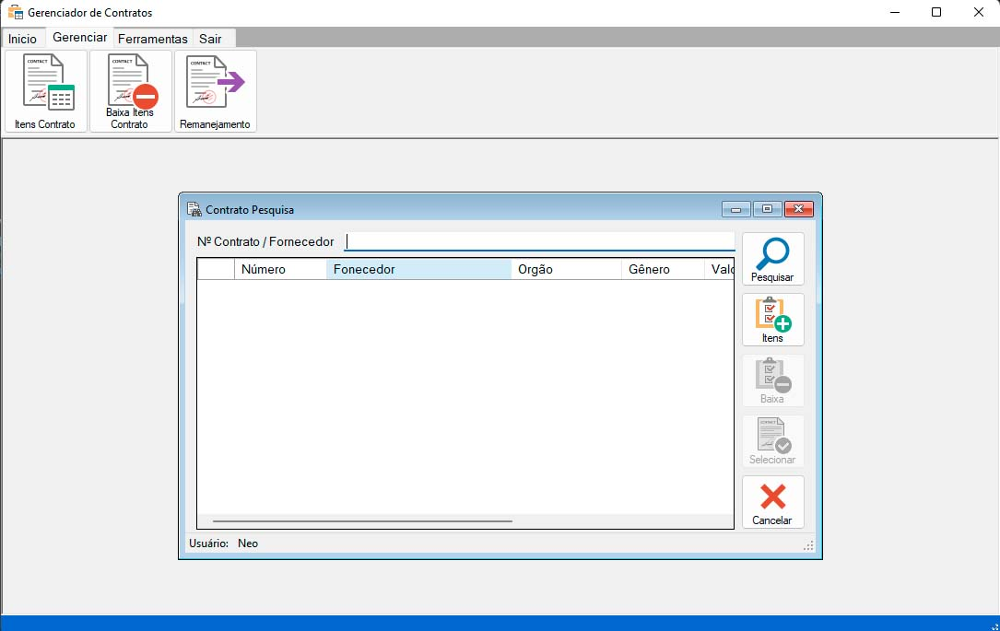

# GerCon
Solução Desenvolvida em C# para Gerenciamento de Contratos.

Aplicação Confeccionada em C# utilizando banco de dados em Firebird, para controle e manutenção de contratos.

Esta é a versão 1.0, em versões posteriores foi adicionado a leitura e adição dos itens ao contrato por excel vindo da licitação, dentre outras melhorias

Um dos problemas em empresas grandes ou mesmo na administração pública é o gerenciamento de contratos com fornecedores, destino dos itens, o gerenciamento em si.

As aplicações são confeccionadas para auxilar a administração e gerenciamento de forma agradável e rápida ao usuário.

Este projeto foi desenvolvido por mim, e é de uso didático de como confeccionar aplicação usando as boas práticas de progamação. 

